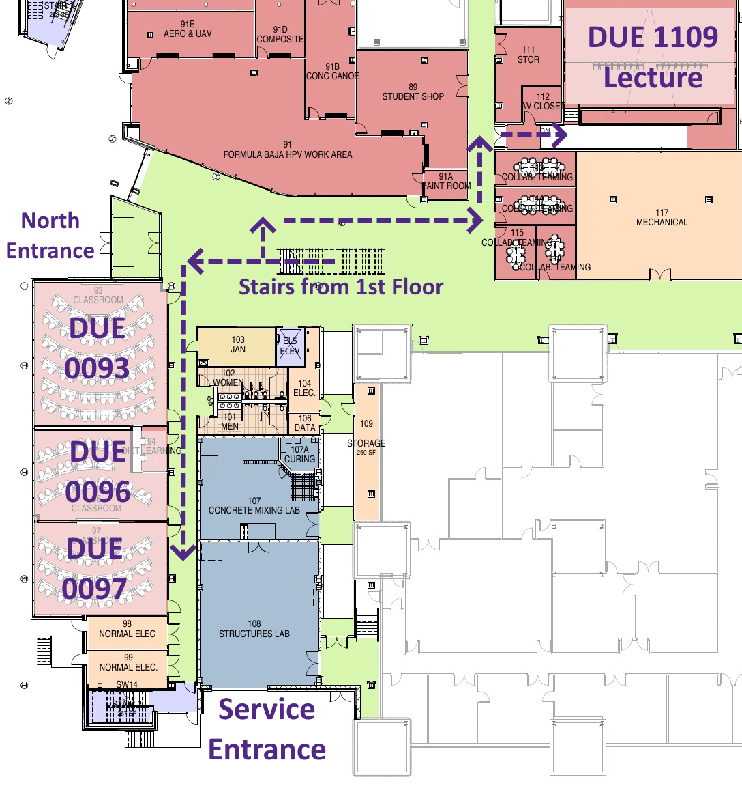

+++
title = "Workshop & Conference"
pre = "<b>C. </b>"
weight = 1
+++

The K-State Advancing Learning & Teaching in Computer Science (ALT+CS) Lab is proud to host the Summer 2023 Teacher Training Workshop in conjunction with the Kansas Computer Science Teachers Association (CSTA) chapter annual conference.

## Travel & Logistics

* **Conference Hotel**: [Holiday Inn Manhattan At the Campus](https://www.ihg.com/holidayinn/hotels/us/en/manhattan/manhi/hoteldetail)
  * Hotel reservations have been handled through the RSVP process. Make sure you get an itemized receipt after checkout!
* **Parking**
  * Hotel guests have free parking at the conference hotel. The conference is a short 10 minute walk to the Engineering Complex.
  * Parking passes are available for registrants who requested one. Parking can be found in lot A28 to the north of the Engineering Complex and also lot D1 to the west of Memorial Stadium.
  * Unfortunately, we **CAN NOT** reimburse anyone for parking in the K-State parking garage. 
* **Meals**
  * Breakfast is provided through the hotel for hotel guests.
  * We have coffee and snacks available in the morning break, but there probably won't be coffee available during check-in (feel free to bring your own!).
  * Lunch is provided each day.
  * Dinner is on your own (we will help coordinate groups that want to continue discussions)
  * Meals on your own will be reimbursed based on per diem.
* **Reimbursement**
  * [W-9 Form](files/irs-w9-highlighted.pdf) - please fill out and upload before conference (or bring it with you).
    * K-State requires a W-9 form from anyone requesting reimbursement. We only need the first page. **It must be signed!**
  * [Expense Report](files/expense-report.pdf) - please fill out and upload ASAP after end of conference. Attach the following items:
    * Itemized receipt (folio) from the hotel after checkout.
    * Round-trip map from your home to the hotel for mileage. 
      * Hint: add your home as the starting point, hotel as the first stop, and then home as a second stop to get round-trip mileage in one map.
      * We can only reimburse mileage for a _personal vehicle_. If you choose to drive a school district vehicle (or similar), mileage will **NOT** be reimbursed. 
    * Itemized receipts for meals are **NOT** required for reimbursement. Meals will be reimbursed based on per diem.
  * [Upload Files Here](https://www.cs.ksu.edu/secure_file_upload.html)

See below for helpful maps of the K-State Campus and the Engineering complex.

## Schedule at a Glance

* **Wednesday 6/21** - Hotel Arrival for Out of Town Guests
  * 3:00 PM - Hotel check-in
  * Dinner on your own
* **Thursday 6/22** - Workshop Day 1
  * 8:30 AM - Arrive at Engineering Complex & Check-in (Atrium)
  * 9:00 AM - Workshop Begins (DUE 1116)
  * 11:45 AM - Lunch (DUE 1116)
  * 4:00 PM - Workshop Ends (DUE 1116)
  * Dinner on your own
* **Friday 6/23** - Workshop Day 2
  * 8:30 AM - Arrive at Engineering Complex & Check-in (Atrium)
  * 9:00 AM - Workshop Begins (DUE 1116)
  * 11:45 AM - Lunch (DUE 1116)
  * 4:00 PM - Workshop Ends (DUE 1116)
  * Dinner on your own
* **Saturday 6/24** - Kansas CSTA Conference
  * 8:30 AM - Arrive at Engineering Complex & Check-in (Atrium)
  * 9:00 AM - Opening Keynote (DUE 1109)
  * 11:45 AM - Lunch (Atrium)
  * 4:00 PM - Conference Ends (DUE 1109)

## Detailed Schedule

### Workshop - Thursday 6/22

[Thursday Zoom Link](https://ksu.zoom.us/j/96304497087?pwd=NzZ1M0FiTHZUT0VRYURvanVrZzJrQT09)

| Time | Room | Title | 
|:----:|:----:|:------|
| 8:30-9:00AM | Engg. Atrium | Check-in |
| 9:00-9:15AM | DUE 1116 | Administrivia |
| 9:15-9:45AM | DUE 1116 | [CS + X (Nathan Bean)](files/cs_plus_x.pptx) |
| _9:45-10:00AM_ | _DUE 1116_ | _Break_ |
| 10:00-10:45AM | DUE 1116 | [CS + X (Nathan Bean)](files/cs_plus_x.pptx) |
| 10:45-11:15AM | DUE 1116 | [Diversity (Amy Betz)](files/teacher_workshop.pptx)   [Paper on Smartness](https://onlinelibrary.wiley.com/doi/epdf/10.1002/jee.20463) |
| 11:15-11:45AM | DUE 1116 | [Recruiting (Josh Weese)](files/recruitment-workshop-day1.pptx) |
| _11:45AM-12:45PM_ | _DUE 1116_ | _Lunch_ |
| 12:45-1:15PM | Beocat | [Beocat Tour (Dan Andresen)](https://kstate.designori.net/)   [Video](https://www.youtube.com/watch?v=3UR4CYTibhU) |
| 1:15-1:45PM | DUE 1116 | [Collaborative Problem Solving (David Allen)](files/collab_problem_solving.pptx) |
| 1:45-2:15PM | DUE 1116 | [Collaborative Problem Solving Breakouts (David Allen)](files/collab_problem_solving.pptx) |
| _2:15-2:25PM_ | _DUE 1116_ | _Break_ |
| 2:25-2:30PM | Campus | Walk to Hale Library |
| 2:30-3:00PM | Hale Library | [Sunderland Innovation Lab Tour](https://lib.k-state.edu/technology/innovation-lab/) |
| 3:00-4:00PM | DUE 1116 | Reflection & Focus Groups (Michelle Friend) |
| Evening | Manhattan | Dinner On Your Own |

### Workshop - Friday 6/23

[Friday Zoom Link](https://ksu.zoom.us/j/96304497087?pwd=NzZ1M0FiTHZUT0VRYURvanVrZzJrQT09)

| Time | Room | Title | 
|:----:|:----:|:------|
| 8:30-9:00AM | Engg. Atrium | Check-in |
| 9:00-9:45AM | DUE 1116 | [State of CS in KS (Stephen King)](https://www.ksde.org/Agency/Division-of-Learning-Services/Career-Standards-and-Assessment-Services/Content-Area-A-E/Computer-Science) |
| _9:45-10:00AM_ | _DUE 1116_ | _Break_ |
| 10:00-11:15AM | DUE 1109 | [STEAM Speaker (Cindy Wallis-Lage)](https://www.k-state.edu/today/announcement/?id=90472) |
| 11:15-11:45AM | Engg. Atrium | STEM Showcase |
| _11:45AM-1:15PM_ | _DUE 1116_ | _Lunch_ |
| 1:15-1:45PM | DUE 1116 | K-State CS K-12 Outreach |
| 1:45-2:15PM | DUE 1116 | Unconference (Russ Feldhausen) |
| _2:15-2:30PM_ | _DUE 1116_ | _Break_ |
| 2:30-3:00PM | DUE 1116 | Unconference (Russ Feldhausen) |
| 3:00-4:00PM | DUE 1116 | Reflection & Focus Groups (Michelle Friend) |
| Evening | Manhattan | Dinner On Your Own |

### KS CSTA Conference - Saturday 6/24

_Note: BOF is shorthand for "Birds of a Feather" - an informal discussion group based on a shared interest without any fixed agenda._

| Time | DUE 1109 | DUE 0093 | DUE 0096 | DUE 0097 | Engg. Atrium |
|:----:|:---------|:---------|:---------|:---------|:-------------|
| **All Day** | [Zoom Link](https://ksu.zoom.us/j/96304497087?pwd=NzZ1M0FiTHZUT0VRYURvanVrZzJrQT09) | [Zoom Link](https://ksu.zoom.us/j/92784520403?pwd=T3BiNGQ2OHFxc0V1dU13NWlCWlFIZz09) | [Zoom Link](https://ksu.zoom.us/j/95197492682?pwd=K3NyZ254WmNpcHl3MEV0SDVkRUwrUT09) | [Zoom  Link](https://ksu.zoom.us/j/98013962666?pwd=RmxsVjJYNlVHbVJCYXQvbEVpTys4Zz09) | |
| 8:30-9:00AM | | | | | Check-in |
| 9:00-10:30AM | Opening Keynote (Michelle Friend ) | | | | |
| _10:30-10:45AM_ | | | | | _Break_ |
| 10:45-11:45AM | AP Exam Preparation (Perla Weaver) | Experiences in CS: A Student Perspective (Panel) | Embedding CS in Early Elementary (Nathan Bean) | | |
| _11:45AM-1:15PM_ |  | | | | _Working Lunch_  |
| 1:15-1:45PM | Science & CS (J.T. Laverty) | Agriculture & CS (Ivan Grijalva) | BOF: Early Elementary (Nathan Bean) | BOF: High School (Russ Feldhausen) | |
| 1:45-2:15PM | Math & CS (David Allen) | Social Science & CS (Michael Flynn) | BOF: Middle Elementary (Nathan Bean) | BOF: High School (Russ Feldhausen) | |
| _2:15-2:30PM_ | | | | | _Break_ |
| 2:30-3:00PM | BOF: Student Recruitment (Josh Weese) | BOF: First Robotics (Nathan Bean) | BOF: CTE Pathways (Russ Feldhausen) | | |
| 3:00-3:30PM | BOF: Game Programming (Nathan Bean) | BOF: Web Development (Russ Feldhausen) | BOF: Potpourri (Josh Weese) | | |
| 3:30-4:00PM | Wrap-up | | | | | |

## Maps

### K-State Campus

[Click Here for the Interactive Map](https://www.k-state.edu/maps/)

Helpful Addresses:

* Conference Hotel: 1641 Anderson Ave, Manhattan, KS 66502
* Engineering Complex: 1701D Platt St, Manhattan, KS 66506

Directions to Engineering Complex:

* From the Conference Hotel: Walk North along Martin Luther King Blvd. (17th St.). Look for the white smokestack - the Engineering complex is just to the west.
* Driving: Look for lot A29 at the corner of Denison Ave and Platt St. (northwest corner of the Engineering Complex). If that lot is full, lot D1 can be found a bit further south on Denison Ave. (just south of Hunting Ave.). 

Parking:
* Hotel guests have free parking at the conference hotel. 
* Parking Passes are valid in lot A28 (north of Engineering Complex) and lot D1 (west of Memorial Stadium) as well as many other surface lots on campus.
* Parking Passes are NOT valid for the parking garage. The parking garage is available at an hourly rate.

### Engineering Hall

#### Main Floor

Most events Thursday and Friday are in DUE 1116, which is on the west side of the building across from the Beocat supercomputer.

#### Ground Floor

Most events on Saturday are in the DUE 1109 Lecture Hall or the rooms on the ground floor on the west side of the building.
